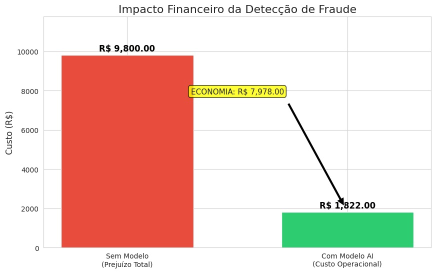
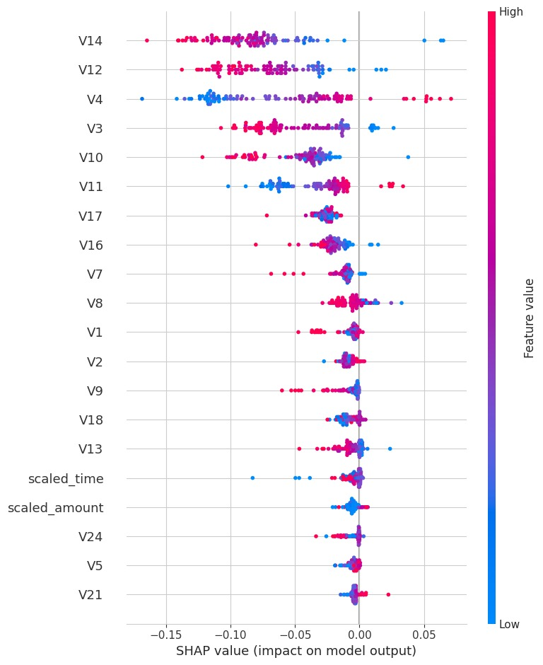

# 🛡️ Deteção de Fraude em Cartões de Crédito


Este projeto de Data Science aplica técnicas de **Machine Learning** para identificar transações fraudulentas, com um foco estratégico na **maximização do Retorno sobre o Investimento (ROI)** e na redução de prejuízos financeiros.

---

## 💼 1. O Problema de Negócio
As fraudes financeiras representam prejuízos bilionários anualmente. O desafio técnico neste conjunto de dados é duplo:
1.  **Desequilíbrio Extremo:** As fraudes representam apenas **0,17%** de todas as transações.
2.  **Custo do Erro:**
    * *Falso Negativo:* O banco perde o valor total da transação (Prejuízo alto).
    * *Falso Positivo:* Custo operacional de verificação e fricção com o cliente (Custo baixo).

**Objetivo:** Desenvolver um modelo que maximize a deteção de fraudes (Recall) mantendo uma precisão viável para a operação.

## 📊 2. Estratégia da Solução
A solução foi desenvolvida seguindo os seguintes passos:

1.  **Análise Exploratória:** Estudo de correlações e padrões temporais nas variáveis anonimizadas (V1-V28).
2.  **Pré-processamento:** Utilização do `RobustScaler` para reduzir o impacto de *outliers* nas colunas 'Amount' e 'Time'.
3.  **Balanceamento de Dados:** Aplicação de **SMOTE** (Synthetic Minority Over-sampling Technique) para gerar exemplos sintéticos de fraudes nos dados de treino, permitindo que o modelo aprenda padrões da classe minoritária.
4.  **Machine Learning:** Treino do algoritmo **Random Forest Classifier**.

## 📈 3. Resultados Chave
O modelo apresentou um desempenho robusto na identificação da classe de interesse (Fraude):

| Métrica | Performance | Interpretação |
| :--- | :--- | :--- |
| **Recall** | **~82%** | O modelo deteta 8 em cada 10 tentativas de fraude. |
| **Precision** | **~88%** | Quando o modelo alerta fraude, acerta em 88% dos casos. |

## 💰 4. Impacto Financeiro (Simulação)
Para traduzir as métricas técnicas em valor de negócio, simulámos um cenário onde o custo médio por fraude é de **R$ 100,00** e o custo de verificação manual é de **R$ 2,00**.



> **Conclusão de Negócio:** A implementação deste modelo resultaria numa **economia estimada superior a 80%** em comparação com um cenário sem deteção automática, provando um ROI elevado.

## 🔍 5. Explicabilidade (White Box)
Utilizámos **SHAP Values** para explicar as decisões do modelo e garantir transparência:



* **Insight:** As variáveis **V14**, **V12** e **V10** foram identificadas como os maiores preditores de risco.
* **Padrão:** Valores negativos nestas variáveis aumentam drasticamente a probabilidade de uma transação ser classificada como fraude.

## 🛠️ Estrutura do Repositório
```text
├── images/                # Imagens dos gráficos (ROI e SHAP)
├── notebook_fraude.ipynb  # Código completo do projeto
├── requirements.txt       # Lista de dependências
└── README.md              # Documentação do projeto


## 🚀 Como Executar

1. Clone este repositório:
```bash
git clone [https://github.com/Gabrinetio/deteccao-fraude-cartao-credito.git](https://github.com/Gabrinetio/deteccao-fraude-cartao-credito.git)

```


2. Instale as dependências:
```bash
pip install -r requirements.txt

```


3. Execute o Jupyter Notebook:
```bash
jupyter notebook notebook_fraude.ipynb

```


